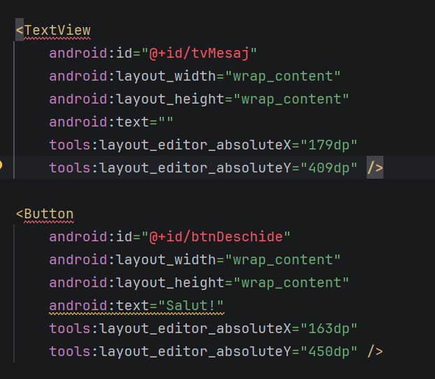

# 01 - Proiect Android, Activity, View Binding

## Obiective

- să înțelegeți ce este o aplicație Android, ce face Gradle și cum este organizat un proiect;
- să creați un proiect Java cu interfață XML (Views) și configurați corect nivelurile SDK;
- să creați un dispozitiv virtual și rulați aplicația pe el;
- să înțelegeți ce este o **Activity**, ce este clasa **R**, ce este **Logcat** și care este **ciclul de viață** al unei Activity;
- să citiți codul generat în `MainActivity` și în `activity_main.xml`: edge-to-edge, `android:id`, dimensiuni și constrângeri;
- să observați ciclul de viață în Logcat, prin mesaje plasate în metodele corespunzătoare;
- să folosiți **View Binding** și navigați către o a doua Activity cu un **Intent** explicit.

Ghidul îmbină pașii practici cu noțiunile teoretice necesare. Dacă nu ați participat la curs, citiți paragrafele explicative înainte de a scrie codul.

## De unde porniți

- Repository clonat (vezi [README.md](../README.md): varianta Android Studio **Clone Repository** sau terminal).
- Android Studio instalat, cu acces la internet pentru primul sync Gradle.

Dacă proiectul este deja prezent în repository după oră, deschideți folderul rădăcină în Android Studio cu **Open** (nu New Project) și continuați doar activitățile nefinalizate.

## 1. Ce este un proiect Android

O aplicație Android este un pachet instalabil pe dispozitiv (APK sau, pentru magazinul de aplicații, Google Play, AAB). În dezvoltare, lucrăm într-un **proiect** Android Studio care conține, printre altele:

| Element               | Rol                                                             |
| --------------------- | --------------------------------------------------------------- |
| Cod Java (sau Kotlin) | Logica aplicației (clase, Activity-uri)                         |
| Resurse (`res/`)      | Layout-uri XML, șiruri de caractere, imagini, meniuri           |
| `AndroidManifest.xml` | Declară componentele aplicației (Activity-uri, permisiuni etc.) |
| Fișiere Gradle        | Descriu cum se compilează proiectul și ce biblioteci folosește  |

Interfața clasică (pe care o folosim în laborator) se bazează pe **Views** și fișiere **XML**. Alternativa modernă promovată de Google este **Jetpack Compose** (declarativă, legată de Kotlin). Noi rămânem pe Views și Java, în concordanță cu fișa disciplinei și cu materialele de seminar ale cursului.

## 2. Gradle - sistemul de build

**Gradle** este instrumentul care compilează sursele, împachetează resursele, rezolvă dependențele (bibliotecile) și produce aplicația instalabilă. În Android Studio, la deschiderea sau modificarea proiectului apare frecvent **Gradle Sync**: mediul citește fișierele de configurare și descarcă, dacă este nevoie, plugin-uri și biblioteci.

Veți lucra în special cu:

- `settings.gradle.kts` - modulele incluse în proiect;
- `build.gradle.kts` (la rădăcină) - setări comune;
- `app/build.gradle.kts` - configurarea modulului aplicației (`minSdk`, `targetSdk`, dependențe);
- `gradle/libs.versions.toml` - catalog de versiuni (în proiectele noi).

Extensia `.kts` înseamnă **Kotlin DSL**: fișierele de build sunt scrise în sintaxă Kotlin, chiar dacă **codul aplicației** rămâne în Java. Nu confundați limbajul aplicației cu limbajul fișierelor Gradle.

Documentație: [Configure your build](https://developer.android.com/build)

## 3. Crearea proiectului

### Activitate

1. Deschideți **Android Studio**.
2. Alegeți **New Project** (sau File → New → New Project).
3. La categoria **Phone and Tablet**, selectați **Empty Views Activity**.

- Nu selectați **Empty Activity**: acel șablon este pentru Jetpack Compose și nu oferă opțiunea Java.

4. Apăsați **Next**. Completați câmpurile astfel:

- **Name:** de exemplu `SemDAM` (sau denumirea stabilită la oră).
- **Package name:** de exemplu `ro.ase.semdam` (se păstrează neschimbat pe tot semestrul). Este identificatorul logic al aplicației; trebuie să coincidă ulterior cu setările din servicii externe (cloud), dacă le folosiți.
- **Save location:** rădăcina repository-ului `seminarii-dam-2026`, sau directorul indicat la oră.
- **Language:** **Java** (valoarea implicită este adesea Kotlin; schimbați selectarea).
- **Minimum SDK:** **API 24** (Android 7.0).
- **Build configuration language:** **Kotlin DSL** (`build.gradle.kts`).

5. Apăsați **Finish** și așteptați finalizarea operației **Gradle Sync**. Este necesară o conexiune la internet stabilă; la primul proiect, descărcarea componentelor SDK și a dependențelor poate dura câteva minute.
6. Android Studio poate **rescrie** fișierul `.gitignore` din rădăcina repository-ului. Readuceți varianta din branch-ul grupei, ca `git status` să rămână curat și un `git pull` ulterior să nu se blocheze în conflicte pe acest fișier (înlocuiți `1086` cu `1088` dacă este cazul):

```powershell
git fetch
git restore --source=origin/grupa/1086 -- .gitignore
```

Verificați cu `git status` că `.gitignore` nu mai apare ca modificare.

### Configurarea nivelurilor SDK

În proiect există două fișiere cu același nume. În **Gradle Scripts** apar unul lângă altul; eticheta din paranteză le deosebește:

| Fișier                             | Unde este                | Rol                                                                                                            |
| ---------------------------------- | ------------------------ | -------------------------------------------------------------------------------------------------------------- |
| `build.gradle.kts` `(Project: …)`  | rădăcina repository-ului | Setări comune: ce plugin-uri există și la ce versiuni. De regulă **nu** conține un bloc `android { }`.         |
| `build.gradle.kts` `(Module: app)` | folderul `app/`          | Cum se construiește **modulul** aplicației: `minSdk`, `targetSdk`, dependențe. Aici este blocul `android { }`. |

Un **modul** este o bucată de proiect pe care Gradle o construiește separat. Șablonul Empty Views Activity are un singur modul de aplicație, `app`: din el iese APK-ul. Fișierul de la rădăcină doar pregătește plugin-urile; nu descrie ecranele și nici SDK-ul.

SDK-urile se verifică în **Module: app** (`app/build.gradle.kts`). Dacă le puneți în fișierul Project, sincronizarea eșuează: acolo nu există blocul `android`.

Deschideți `app/build.gradle.kts` (Module: app) și verificați (corectați dacă este necesar):

```kotlin
compileSdk = 36

defaultConfig {
    minSdk = 24
    targetSdk = 36
}

compileOptions {
    sourceCompatibility = JavaVersion.VERSION_17
    targetCompatibility = JavaVersion.VERSION_17
    isCoreLibraryDesugaringEnabled = true
}
```

În `dependencies { ... }` adăugați desugaring (necesar mai târziu pentru `java.time.LocalDate` pe `minSdk 24`):

```kotlin
coreLibraryDesugaring("com.android.tools:desugar_jdk_libs:2.1.5")
```

(Versiunea exactă a bibliotecii se poate actualiza la oră.) Sincronizați Gradle după modificări.

| Câmp         | Semnificație                                                                                                                                                                       |
| ------------ | ---------------------------------------------------------------------------------------------------------------------------------------------------------------------------------- |
| `minSdk`     | Cea mai veche versiune de Android pe care o suportă aplicația. Dispozitivele cu API mai mic nu o vor putea instala.                                                                |
| `compileSdk` | Nivelul API folosit **la compilare**. Decide ce clase și metode din SDK sunt disponibile în editor.                                                                                |
| `targetSdk`  | Comportamentul de platformă pe care îl **declară** aplicația față de sistem. De la **31 august 2026**, Google Play solicită **API 36** pentru aplicații noi și pentru actualizări. |

`minSdk`, `compileSdk` și `targetSdk` nu sunt interschimbabile. Un proiect tipic compilează cu un SDK recent, țintește un `targetSdk` actual (cerințe de magazin și securitate) și păstrează un `minSdk` suficient de coborât pentru dispozitivele din laborator sau din publicul țintă.

Dacă ați modificat fișierul, declanșați din nou sincronizarea Gradle (**Sync Now**).

## 4. Ce este o Activity

O **Activity** reprezintă un ecran cu care utilizatorul interacționează (sau o fereastră a aplicației). Din punct de vedere al platformei, este o **componentă** Android: trebuie declarată în `AndroidManifest.xml`, iar sistemul îi gestionează crearea, afișarea și distrugerea.

În proiectul generat există de obicei `MainActivity`, legată de layout-ul `activity_main.xml`. Metoda centrală la pornire este `onCreate`: aici se asociază layout-ul (`setContentView`) și se inițializează controalele.

Relația uzuală:

1. utilizatorul (sau sistemul) cere afișarea unui ecran;
2. Android creează instanța clasei Activity;
3. se apelează metodele din **ciclul de viață** (secțiunea dedicată, mai jos);
4. interfața definită în XML (sau în cod) este afișată pe dispozitiv.

Documentație: [Introduction to activities](https://developer.android.com/guide/components/activities/intro-activities)

## 5. Clasa R - legătura dintre resurse și cod

Folderul `res/` conține resurse: layout-uri (`res/layout/`), șiruri (`res/values/strings.xml`), imagini (`res/drawable/`), meniuri (`res/menu/`) etc. La compilare, Android Gradle Plugin **generează** o clasă Java numită `R` (de la _Resources_), în pachetul aplicației.

**Nu editați manual clasa** `R`**.** Este recreată la fiecare build. Dacă lipsește sau pare „stricată”, de obicei proiectul nu a compilat încă sau există o eroare în XML.

### Ce conține

`R` este organizată în **clase interne** pe tipuri de resurse. Exemple frecvente:

| Acces tipic              | Provine din                                       | Rol                               |
| ------------------------ | ------------------------------------------------- | --------------------------------- |
| `R.layout.activity_main` | `res/layout/activity_main.xml`                    | Identificatorul layout-ului       |
| `R.id.btnDeschide`       | atributul `android:id="@+id/btnDeschide"` din XML | Identificatorul unui view         |
| `R.string.app_name`      | o intrare din `strings.xml`                       | Un șir de caractere               |
| `R.menu.meniu_principal` | `res/menu/meniu_principal.xml`                    | Un meniu (într-un seminar viitor) |
| `R.drawable....`         | un fișier din `drawable`                          | O imagine sau un desen            |

Valorile din `R` sunt **întregi (int)** stabili în cadrul unui build: sistemul le folosește ca indici interni spre resursa reală. În cod nu scrieți calea fișierului XML; scrieți `R.layout...` sau `R.id...`.

### La ce folosește

Înainte de View Binding, asocierea layout-ului arăta astfel:

```java
setContentView(R.layout.activity_main);
Button btn = findViewById(R.id.btnDeschide);
```

Cu View Binding, folosiți mai rar `R.id` în Activity (accesați `binding.btnDeschide`), dar `R` rămâne esențială: încărcarea layout-urilor, meniurilor, string-urilor, drawable-urilor și multe API-uri Android cer tot un `R....`.

### Reguli practice

- Numele din XML trebuie să respecte convențiile (litere mici, underscore). Din `btn_deschide` în XML, View Binding generează de obicei `btnDeschide`; în `R.id` rămâne forma cu underscore: `R.id.btn_deschide` (în funcție de cum ați denumit id-ul).
- Dacă redenumiți un id în XML și proiectul nu compilează, căutați referințele vechi din Java.
- Există și `android.R` (resurse ale platformei, de exemplu `android.R.layout.simple_list_item_1`). Nu o confundați cu `R` a aplicației voastre (`ro.ase.semdam.R`).

În secțiunea următoare, acești identificatori apar în codul generat de Android Studio (`R.layout.activity_main`, `R.id.main`).

Documentație: [App resources overview](https://developer.android.com/guide/topics/resources/providing-resources)

## 6. Codul generat: MainActivity și activity_main.xml

Imediat după **Finish**, Android Studio deschide `MainActivity.java`. În materiale mai vechi, `onCreate` conținea în esență doar `super.onCreate` și `setContentView`. Șablonul **Empty Views Activity** actual adaugă două apeluri, pentru că, de la Android 15, fereastra aplicației se desenează până la marginile ecranului. Nu le ștergeți când adăugați mesaje în Logcat sau când treceți la View Binding.

În funcție de versiunea mediului, importurile sau ordinea atributelor din XML pot diferi ușor. Corpul de mai jos este cel generat de versiunile recente.

### MainActivity

```java
public class MainActivity extends AppCompatActivity {

    @Override
    protected void onCreate(Bundle savedInstanceState) {
        super.onCreate(savedInstanceState);
        EdgeToEdge.enable(this);
        setContentView(R.layout.activity_main);
        ViewCompat.setOnApplyWindowInsetsListener(findViewById(R.id.main), (v, insets) -> {
            Insets systemBars = insets.getInsets(WindowInsetsCompat.Type.systemBars());
            v.setPadding(systemBars.left, systemBars.top, systemBars.right, systemBars.bottom);
            return insets;
        });
    }
}
```

Deasupra clasei stau declarația de pachet și importurile (`EdgeToEdge`, `AppCompatActivity`, `Insets`, `ViewCompat`, `WindowInsetsCompat`). Dacă ștergeți un import din greșeală, readuceți-l din sugestia mediului.

- `extends AppCompatActivity`: ecranul vostru moștenește Activity-ul din AndroidX, nu clasa veche `android.app.Activity`. Aceasta este baza pe care o folosim tot semestrul.
- `onCreate`: prima metodă în care puteți lega layout-ul de ecran. Parametrul `savedInstanceState` poate conține stare salvată dacă sistemul a distrus și a recreat Activity-ul (de exemplu la rotirea ecranului). La prima pornire este, de regulă, `null`. Îl legăm de ciclul de viață; nu îl folosim încă.
- `super.onCreate(...)`: obligatoriu, înainte de logica voastră. Clasa părinte își face propriile inițializări.
- `setContentView(R.layout.activity_main)`: încarcă `res/layout/activity_main.xml` și îl afișează. Fără această linie (sau echivalentul cu View Binding), ecranul rămâne gol.
- `findViewById(R.id.main)`: după `setContentView`, caută în layout view-ul cu id-ul `main`. Apelul trebuie să vină **după** `setContentView`; altfel rezultatul este `null` și aplicația se oprește la deschidere.

### EdgeToEdge.enable(this)

Multă vreme, sistemul rezerva două benzi, iar aplicația desena doar între ele:

- **bara de stare** (sus): ora, baterie, notificări;
- **bara de navigare** (jos): butoanele Înapoi, ecran principal și aplicații recente, sau zona gesturilor.

**Edge-to-edge** înseamnă că layout-ul se întinde și sub aceste bare. Barele devin transparente (la navigarea cu trei butoane, bara de jos poate rămâne ușor umbrită, ca butoanele să rămână vizibile), iar iconițele își adaptează culoarea la tema deschisă sau închisă.

`EdgeToEdge.enable(this)` cere acest mod pentru Activity-ul curent. Pe Android 15 (API 35) sau ulterior, dacă `targetSdk` este 35 sau mai mare, platforma îl impune oricum. Apelul rămâne necesar: pe versiunile mai vechi, de la `minSdk` 24 în sus, reproduce același comportament, ca aplicația să arate la fel pe emulator și pe telefoane mai vechi.

Nu încercați să îl dezactivați ca să „reparați” culoarea barei. În exemple mai vechi apare atributul `windowOptOutEdgeToEdgeEnforcement`. Nu îl folosiți: pentru `targetSdk` 36, pe un dispozitiv cu Android 16, renunțarea nu mai are efect.

### Listener-ul de insets

Dacă desenăm sub bare, textul sau butoanele pot ajunge dedesubt și nu se mai pot citi sau apăsa. Sistemul raportează cât spațiu ocupă acele bare. Aceste distanțe se numesc **window insets**.

`ViewCompat.setOnApplyWindowInsetsListener` înregistrează un callback pe un view. `ViewCompat` este varianta din AndroidX: același apel merge pe API-urile dintre `minSdk` și `targetSdk`. Sistemul apelează callback-ul la pornire și din nou dacă distanțele se schimbă (rotație, alt mod de navigare).

Săgeata `->` este o expresie lambda: o funcție scurtă transmisă ca argument. Echivalentul ar fi o clasă anonimă. Nu o rescrieți; citiți parametrii.

| Element                                     | Rol                                                                                                                                                            |
| ------------------------------------------- | -------------------------------------------------------------------------------------------------------------------------------------------------------------- |
| `findViewById(R.id.main)`                   | View-ul rădăcină din XML, cel cu `android:id="@+id/main"`. Padding-ul pus pe el împinge **tot** conținutul în interior, nu un singur text.                     |
| `v`                                         | Același view, primit în callback.                                                                                                                              |
| `insets`                                    | Obiectul cu distanțele raportate de sistem.                                                                                                                    |
| `WindowInsetsCompat.Type.systemBars()`      | Cere distanțele pentru barele de sistem (bara de stare și bara de navigare).                                                                                   |
| `Insets` (`left`, `top`, `right`, `bottom`) | Valorile, în pixeli. Nu le înmulțiți cu densitatea ecranului: sunt deja în pixeli.                                                                             |
| `v.setPadding(...)`                         | Spațiu în **interiorul** view-ului rădăcină. Copiii se așază în zona rămasă, deci „Hello World!” coboară sub bara de stare și urcă deasupra barei de navigare. |
| `return insets`                             | Returnăm obiectul primit, nemodificat, cum face șablonul. Nu îl înlocuiți cu `WindowInsetsCompat.CONSUMED`.                                                    |

### activity_main.xml

Layout-ul generat arată, în esență, astfel:

```xml
<?xml version="1.0" encoding="utf-8"?>
<androidx.constraintlayout.widget.ConstraintLayout xmlns:android="http://schemas.android.com/apk/res/android"
    xmlns:app="http://schemas.android.com/apk/res-auto"
    xmlns:tools="http://schemas.android.com/tools"
    android:id="@+id/main"
    android:layout_width="match_parent"
    android:layout_height="match_parent"
    tools:context=".MainActivity">

    <TextView
        android:layout_width="wrap_content"
        android:layout_height="wrap_content"
        android:text="Hello World!"
        app:layout_constraintBottom_toBottomOf="parent"
        app:layout_constraintEnd_toEndOf="parent"
        app:layout_constraintStart_toStartOf="parent"
        app:layout_constraintTop_toTopOf="parent" />

</androidx.constraintlayout.widget.ConstraintLayout>
```

Puteți comuta în editor între **Code**, **Split** și **Design**. Explicația se referă la XML: editorul vizual scrie aceleași atribute.

Cele trei declarații `xmlns` sunt prefixe de nume:

| Prefix          | La ce folosește                                                                                                                                                                        |
| --------------- | -------------------------------------------------------------------------------------------------------------------------------------------------------------------------------------- |
| `xmlns:android` | Atributele platformei: `android:id`, `android:layout_width`, `android:text`.                                                                                                           |
| `xmlns:app`     | Atribute din biblioteci. Constrângerile ConstraintLayout sunt `app:layout_constraint...`.                                                                                              |
| `xmlns:tools`   | Doar pentru editor, nu pentru aplicația care rulează. `tools:context=".MainActivity"` spune previzualizării ce Activity folosește fișierul. Punctul înseamnă „în pachetul aplicației”. |

`android:text` este textul afișat. Șablonul îl pune direct în XML. Dacă vedeți `@string/...`, șirul stă în `res/values/strings.xml`; pe ecran efectul este același.

### android:id

Un **id** este numele prin care codul găsește un view (`R.id.main`, mai târziu `binding.main`).

- `android:id="@+id/main"` declară id-ul. Semnul `+` îl adaugă în clasa `R` dacă nu există deja.
- `@id/nume`, fără `+`, doar face referire la un id deja declarat. Îl veți folosi când un view indică alt view.
- Rădăcina **are** id (`main`), pentru că listener-ul din Java caută `R.id.main`.
- `TextView`-ul generat, de obicei, **nu** are id. Nu este o omisiune: până nu îl accesați din Java, id-ul nu este necesar. Când legați un buton sau un text din cod, adăugați `android:id="@+id/..."`.

### layout_width și layout_height

Aproape orice view trebuie să spună cât este de lat și cât este de înalt. Fără aceste două atribute, layout-ul nu compilează.

| Valoare                         | Efect                                                                                                                                                                 |
| ------------------------------- | --------------------------------------------------------------------------------------------------------------------------------------------------------------------- |
| `match_parent`                  | Ocupă tot spațiul oferit de părinte, pe acea dimensiune. Rădăcina umple ecranul.                                                                                      |
| `wrap_content`                  | Doar cât cere conținutul (textul, eticheta butonului, copiii). `TextView`-ul generat stă pe „Hello World!”, nu pe tot ecranul.                                        |
| o dimensiune, de exemplu `48dp` | Mărime fixă. `dp` (density-independent pixels) arată similar pe ecrane cu densități diferite. Nu folosiți `px`.                                                       |
| `0dp`                           | Doar pentru un **copil** din ConstraintLayout: mărimea o dau constrângerile (_match constraints_). Editorul poate afișa aceeași alegere sub numele Match Constraints. |

`fill_parent` este numele vechi al lui `match_parent`. Îl puteți vedea în exemple vechi; nu îl mai scrieți.

Pe rădăcină, `match_parent` este corect: părintele ei este fereastra, nu un alt ConstraintLayout. Pentru un view **din interior**, nu puneți `match_parent`. Dacă trebuie să se întindă între două margini, folosiți `0dp` și constrângeri pe ambele laturi.

### ConstraintLayout și constrângerile

**ConstraintLayout** este un container: ține alte view-uri și le poziționează prin **constrângeri** (legături de la o latură a copilului la o latură a părintelui sau a altui view). Nu le așază doar unul sub altul, ca un `LinearLayout`. Șablonul îl pune ca rădăcină, iar dependența este deja în Gradle. Rămânem pe el pentru ecranele din laborator.

Nu intrăm în celelalte mecanisme (chains, barriers, guidelines). Ajunge să citiți constrângerile generate și să le scrieți pe cele noi când adăugați un buton.

Cele patru atribute de pe `TextView` spun, fiecare, „lipește latura mea de latura indicată”:

| Atribut                                           | Citire                                                                                             |
| ------------------------------------------------- | -------------------------------------------------------------------------------------------------- |
| `app:layout_constraintTop_toTopOf="parent"`       | Marginea de sus a textului se leagă de marginea de sus a părintelui.                               |
| `app:layout_constraintBottom_toBottomOf="parent"` | Marginea de jos se leagă de marginea de jos a părintelui.                                          |
| `app:layout_constraintStart_toStartOf="parent"`   | Începutul (stânga, când textul se scrie de la stânga la dreapta) se leagă de începutul părintelui. |
| `app:layout_constraintEnd_toEndOf="parent"`       | Sfârșitul se leagă de sfârșitul părintelui.                                                        |

`parent` înseamnă părintele direct, aici ConstraintLayout-ul rădăcină. Împreună cu `wrap_content`, cele patru legături **centrează** textul: este tras de toate laturile, dar rămâne cât textul. Dacă ați lăsa doar constrângerea de sus și pe cea de început, textul ar sta în colțul de sus, la început.

Dacă lățimea ar fi `0dp`, cu începutul și sfârșitul legate de `parent`, view-ul s-ar întinde pe toată lățimea, nu ar rămâne de mărimea textului, în centru.

În loc de `parent`, valoarea poate fi id-ul altui view:

| Atribut                                             | Efect                                                                                              |
| --------------------------------------------------- | -------------------------------------------------------------------------------------------------- |
| `app:layout_constraintTop_toBottomOf="@id/tvMesaj"` | Marginea mea de sus stă sub marginea de jos a lui `tvMesaj`.                                       |
| `app:layout_constraintStart_toEndOf="@id/tvMesaj"`  | Începutul meu stă la sfârșitul lui `tvMesaj` (în dreapta lui, la scriere de la stânga la dreapta). |

Tiparul numelui este `layout_constraint` + latura mea + `_to` + latura celuilalt + `Of`. Laturile uzuale sunt Top, Bottom, Start, End. Mai există:

- `layout_constraintBaseline_toBaselineOf`: aliniază linia de bază a două texte (literele stau pe același rând imaginar);
- `layout_constraintHorizontal_bias` și `layout_constraintVertical_bias`: un număr între 0 și 1, doar când există constrângeri pe ambele laturi opuse. 0 lipește view-ul de început sau de sus, 1 de sfârșit sau de jos, 0.5 îl centrează (valoarea implicită, de aceea „Hello World!” este la mijloc);
- variante cu Left și Right în loc de Start și End. Există, dar nu le folosim: Start și End se oglindesc corect dacă limba se scrie de la dreapta la stânga.

`android:layout_margin`, `layout_marginTop`, `layout_marginStart` și celelalte margini adaugă spațiu de-a lungul unei constrângeri. Nu înlocuiesc `layout_width`: marginea este distanța, nu mărimea view-ului.

Un view pus într-un ConstraintLayout fără nicio constrângere ajunge în colțul din stânga-sus, chiar dacă în editor părea în altă parte. Când adăugați un buton, dați-i id, lățime, înălțime și cel puțin constrângeri către `parent` sau către un view vecin.

Documentație: [Display content edge-to-edge in views](https://developer.android.com/develop/ui/views/layout/edge-to-edge), [ConstraintLayout](https://developer.android.com/develop/ui/views/layout/constraint-layout)

## 7. Dispozitiv virtual (emulator)

Pentru a vedea aplicația rulând nu este suficientă compilarea: este nevoie de un **dispozitiv**. Emulatorul Android este inclus în Android Studio. Nu se instalează separat ca produs distinct; din **Device Manager** creați și porniți un _Virtual Device_.

### Activitate - crearea unui AVD

1. În Android Studio deschideți **Device Manager** (iconița de telefon din bara laterală sau View → Tool Windows → Device Manager).
2. Apăsați **Create Device** (sau **+**).
3. Alegeți o definiție de telefon (de exemplu Pixel) → **Next**.
4. Selectați o imagine de sistem cu **API 36** sau **API 37** (dacă lipsește, folosiți **Download** lângă imagine; este necesară conexiune la internet).
5. Finalizați cu **Finish**.
6. Porniți dispozitivul (butonul Play din Device Manager), apoi rulați aplicația cu butonul **Run** (triunghi verde) din bara de instrumente, alegând dispozitivul creat.

**Observații practice**

- Prima pornire a unui AVD este mai lentă (se inițializează imaginea de sistem).
- Pentru performanță, pe Windows este utilă accelerarea hardware (Hyper-V / WHPX), dacă laboratorul o permite.
- Dacă emulatorul încetinește calculatorul, rulați aplicația pe telefonul propriu, prin Wi-Fi. Pașii (`adb pair`, `adb connect`) sunt în [README.md](../README.md).

Documentație: [Create and manage virtual devices](https://developer.android.com/studio/run/managing-avds)

## 8. Logcat - jurnalul de rulare

**Logcat** este fereastra din Android Studio în care apar mesajele emise de sistem și de aplicație în timpul execuției. Este instrumentul principal de depanare când nu folosiți încă un debugger pas cu pas.

Deschidere: View → Tool Windows → **Logcat** (sau tab-ul Logcat în partea de jos).

Mesajele au un **nivel** (Verbose, Debug, Info, Warn, Error) și, de regulă, un **tag** (etichetă scurtă aleasă de voi, de exemplu `MainActivity`). Puteți filtra după numele aplicației, după tag sau după text.

În cod, pentru mesaje de depanare:

```java
Log.d("MainActivity", "Mesaj de tip Debug");
```

Importul uzual: `android.util.Log`.  
Convenție: primul argument este tag-ul, al doilea este mesajul. Folosiți `Log.d` (debug) pentru urmărirea ciclului de viață; evitați să lăsați în aplicațiile reale date sensibile în jurnal.

Documentație: [Write and view logs](https://developer.android.com/studio/debug/am-logcat)

## 9. Ciclul de viață al unei Activity

Sistemul Android nu vă lasă să controlați liber „pornirea” și „oprirea” ecranului ca într-un `main()` clasic. În schimb, apelează un set de metode callback, în ordine, pe măsură ce Activity-ul devine vizibil, pierde focusul sau este distrus. Acest ansamblu se numește **activity lifecycle**.

Metodele esențiale (în ordinea tipică la pornire și, invers, la închidere):

| Metodă      | Când intervine (idee intuitivă)                                                        |
| ----------- | -------------------------------------------------------------------------------------- |
| `onCreate`  | Activity-ul este creat. Aici setați layout-ul și inițializările de bază.               |
| `onStart`   | Activity-ul devine vizibil pentru utilizator.                                          |
| `onResume`  | Activity-ul este în prim-plan și poate primi interacțiuni.                             |
| `onPause`   | Activity-ul pierde focusul (apare alt ecran deasupra, dialog etc.).                    |
| `onStop`    | Activity-ul nu mai este vizibil.                                                       |
| `onDestroy` | Activity-ul este pe cale să fie distrus (închidere, sistemul eliberează memoria etc.). |
| `onRestart` | Activity-ul repornește după `onStop`, înainte de un nou `onStart`.                     |

La fiecare metodă pe care o suprascrieți, apelați mai întâi `super.onXxx(...)`, apoi scrieți logica voastră.

Documentație: [Activity lifecycle](https://developer.android.com/guide/components/activities/activity-lifecycle)

### Activitate - observarea ciclului de viață în Logcat

1. Deschideți `MainActivity.java`.
2. Definiți o constantă pentru tag, de exemplu:

```java
private static final String TAG = "MainActivity";
```

1. Suprascrieți metodele de lifecycle și scrieți câte un mesaj în fiecare. Nu înlocuiți corpul deja scris al lui `onCreate` (`EdgeToEdge`, `setContentView`, listener-ul de insets): adăugați doar `Log.d`. Exemplu pentru câteva dintre ele (completați analog pentru `onStart`, `onResume`, `onPause`, `onStop`, `onRestart`, `onDestroy`):

```java
@Override
protected void onCreate(Bundle savedInstanceState) {
    super.onCreate(savedInstanceState);
    // păstrați EdgeToEdge, setContentView și listener-ul de insets
    Log.d(TAG, "onCreate");
}

@Override
protected void onStart() {
    super.onStart();
    Log.d(TAG, "onStart");
}

@Override
protected void onResume() {
    super.onResume();
    Log.d(TAG, "onResume");
}

@Override
protected void onPause() {
    super.onPause();
    Log.d(TAG, "onPause");
}

@Override
protected void onStop() {
    super.onStop();
    Log.d(TAG, "onStop");
}

@Override
protected void onDestroy() {
    super.onDestroy();
    Log.d(TAG, "onDestroy");
}

@Override
protected void onRestart() {
    super.onRestart();
    Log.d(TAG, "onRestart");
}
```

1. Rulați aplicația. În Logcat, filtrați după tag-ul `MainActivity` (sau după numele pachetului).
2. Experimentați și urmăriți ordinea mesajelor:

- pornirea aplicației;
- apăsarea butonului Home (aplicația trece în fundal);
- revenirea la aplicație din lista de recente;
- rotirea ecranului (dacă nu ați blocat orientarea, Activity-ul poate fi distrus și recreat: veți vedea din nou `onDestroy` / `onCreate`);
- închiderea Activity-ului.

Notați pe scurt, în caiet sau într-un comentariu, ce ordine ați observat. Scopul este să legați teoria de comportamentul real al platformei.

## 10. View Binding

Fără View Binding, legătura dintre XML și Java se face adesea cu `findViewById(R.id....)`, deci tot prin clasa `R`. Apelurile sunt verbose și predispuse la greșeli (identificator greșit, cast greșit). **View Binding** generează, la compilare, o clasă Java pentru fiecare layout (de exemplu `ActivityMainBinding` pentru `activity_main.xml`), cu câmpuri tipizate pentru fiecare view care are `android:id`.

`viewBinding` se activează în același fișier ca SDK-urile: `app/build.gradle.kts`, cel marcat **Module: app** (diferența față de Project este în secțiunea 3). Opțiunea stă în blocul `android { }`. În fișierul de la rădăcină sincronizarea eșuează, pentru că acolo nu există acest bloc.

### Activitate

1. Deschideți `app/build.gradle.kts`, cel marcat **Module: app** (nu **Project**). În blocul `android { ... }` adăugați:

```kotlin
buildFeatures {
    viewBinding = true
}
```

1. Sincronizați proiectul Gradle.
2. În `MainActivity.java`, folosiți tiparul:

```java
private ActivityMainBinding binding;

@Override
protected void onCreate(Bundle savedInstanceState) {
    super.onCreate(savedInstanceState);
    EdgeToEdge.enable(this);
    binding = ActivityMainBinding.inflate(getLayoutInflater());
    setContentView(binding.getRoot());
    ViewCompat.setOnApplyWindowInsetsListener(binding.main, (v, insets) -> {
        Insets systemBars = insets.getInsets(WindowInsetsCompat.Type.systemBars());
        v.setPadding(systemBars.left, systemBars.top, systemBars.right, systemBars.bottom);
        return insets;
    });
    Log.d(TAG, "onCreate");
}
```

Clasa `ActivityMainBinding` este generată la compilare din `activity_main.xml`. Dacă nu apare în completările IDE, rulați **Build → Rebuild Project**.

Cele trei apeluri, în ordine:

1. `binding = ActivityMainBinding.inflate(getLayoutInflater())` citește XML-ul și construiește în memorie ierarhia de view-uri. `getLayoutInflater()` este inflater-ul Activity-ului (cunoaște tema ecranului). Rezultatul umple câmpurile tipizate: fiecare `android:id` devine un câmp (`binding.tvMesaj`, `binding.btnDeschide` etc.).
2. `setContentView(binding.getRoot())` trebuie să urmeze imediat. `inflate` doar creează obiectele; nu le pune pe ecran. `getRoot()` este view-ul din vârful layout-ului (ConstraintLayout-ul). Fără `setContentView`, ecranul rămâne gol. Nu păstrați și `setContentView(R.layout.activity_main)`: ați încărca layout-ul a doua oară, iar `binding` ar indica o ierarhie care nu este cea afișată.
3. Listener-ul trece de la `findViewById(R.id.main)` la `binding.main`. `findViewById` caută în ierarhia deja afișată prin `setContentView`; pe varianta veche, `R.id.main` exista pentru că se încărca direct `R.layout.activity_main`. `binding.main` este același view (rădăcina are `android:id="@+id/main"`), luat din arborele tocmai creat. Așa padding-ul de la edge-to-edge se aplică pe ecranul pe care îl vedeți, nu pe o copie neafișată.

### Observații

- Rolul lui `EdgeToEdge.enable` și al listener-ului este explicat în secțiunea 6. Nu le ștergeți la trecerea pe View Binding. Dacă textul ajunge sub bara de stare, padding-ul de pe rădăcină lipsește sau a fost scos.
- În materiale mai vechi apare frecvent `findViewById` pentru fiecare control. În acest laborator, controalele pe care le accesați din cod trec prin View Binding. Listener-ul de insets rămâne pe `binding.main`.

Documentație: [View Binding](https://developer.android.com/topic/libraries/view-binding)

## 11. Controale simple și Toast

Un **layout XML** descrie ierarhia de view-uri (butoane, texte, containere). Atributele de id, dimensiune și constrângere sunt cele din secțiunea 6. După View Binding, accesați controalele prin `binding.numeId` (id-ul din XML, fără underscore-uri transformate după regulile de generare).

Un **Toast** este un mesaj scurt, neblocant, afișat peste aplicație. Nu înlocuiește un dialog; este util pentru confirmări rapide la seminar.

### Activitate

1. Deschideți `res/layout/activity_main.xml`.
2. Adăugați un `TextView` și un `Button`, cu id-urile `tvMesaj` și `btnDeschide`. Dacă le plasați prin drag and drop, oriunde pe ecran, editorul nu scrie constrângeri. Scrie doar `tools:layout_editor_absoluteX` și `tools:layout_editor_absoluteY`: poziția din previzualizare, ignorată la rulare. ConstraintLayout marchează tag-ul cu eroare, pentru că view-ul nu este legat de nimic.



Ștergeți atributele `tools:layout_editor_absolute*` și adăugați constrângeri, ca în secțiunea 6. Textul se leagă de părinte; butonul, de text:

```xml
<TextView
    android:id="@+id/tvMesaj"
    android:layout_width="wrap_content"
    android:layout_height="wrap_content"
    android:text="Mesaj"
    app:layout_constraintStart_toStartOf="parent"
    app:layout_constraintTop_toTopOf="parent" />

<Button
    android:id="@+id/btnDeschide"
    android:layout_width="wrap_content"
    android:layout_height="wrap_content"
    android:text="Deschide"
    app:layout_constraintStart_toStartOf="parent"
    app:layout_constraintTop_toBottomOf="@id/tvMesaj" />
```

1. În `MainActivity`, după inițializarea `binding`:

```java
binding.btnDeschide.setOnClickListener(v ->
        Toast.makeText(this, "Funcționează!", Toast.LENGTH_SHORT).show()
);
```

2. Rulați aplicația. La apăsarea butonului trebuie să apară mesajul Toast. În Logcat puteți urmări în continuare evenimentele de lifecycle.

## 12. A doua Activity și Intent

Un **Intent** este un mesaj prin care cereți sistemului să efectueze o acțiune. Un Intent **explicit** denumește componenta țintă (de exemplu o clasă Activity din aplicația voastră). Un Intent **implicit** descrie o acțiune generală (trimitere email, deschidere URL) și lasă sistemul să aleagă o aplicație potrivită. În acest seminar folosim doar Intent explicit.

Orice Activity nouă trebuie declarată în `AndroidManifest.xml`. Fără această declarație, pornirea ecranului eșuează.

### Activitate

1. File → New → Activity → **Empty Views Activity**.
2. Nume: `SecondActivity`, Language: **Java**.
3. Verificați în `AndroidManifest.xml` că `SecondActivity` este declarată (de regulă, mediul o înregistrează automat).
4. Modificați callback-ul de click al butonului astfel încât să deschidă a doua activitate:

```java
binding.btnDeschide.setOnClickListener(v -> {
    Intent intent = new Intent(MainActivity.this, SecondActivity.class);
    startActivity(intent);
});
```

5. Pe `SecondActivity` puteți afișa un `TextView` cu un mesaj simplu (de exemplu „Ecran secundar”) și, opțional, aceleași mesaje `Log.d` în metodele de lifecycle, cu un tag distinct (`SecondActivity`). Șablonul pune și aici `EdgeToEdge` și listener-ul de insets: păstrați-le. Veți observa în Logcat cum `MainActivity` trece prin `onPause` / `onStop`, iar `SecondActivity` prin `onCreate` / `onStart` / `onResume`.

Nu transmitem încă obiecte prin Intent. Acest subiect îl vom acoperi într-un seminar viitor.

Documentație: [Intents and Intent Filters](https://developer.android.com/guide/components/intents-filters)

## Verificare

- [ ] Proiectul compilează fără erori; Gradle Sync s-a încheiat cu succes.
- [ ] Ați creat un dispozitiv virtual și ați rulat aplicația pe el (sau pe telefon).
- [ ] Înțelegeți pe scurt rolul Gradle, al clasei `R` și diferența `minSdk` / `targetSdk` / `compileSdk`.
- [ ] Puteți explica pe scurt `EdgeToEdge.enable`, listener-ul de insets și atributele `match_parent`, `wrap_content`, `android:id` și `app:layout_constraint*`.
- [ ] View Binding este activat, iar `MainActivity` îl folosește.
- [ ] În Logcat apar mesajele din metodele de lifecycle, în ordinea așteptată la pornire, la trecerea în fundal și la deschiderea celei de-a doua Activity.
- [ ] Butonul deschide `SecondActivity`.

## Bibliografie

- [Create a project](https://developer.android.com/studio/projects/create-project)
- [Configure your build (Gradle)](https://developer.android.com/build)
- [Introduction to activities](https://developer.android.com/guide/components/activities/intro-activities)
- [Activity lifecycle](https://developer.android.com/guide/components/activities/activity-lifecycle)
- [Logcat](https://developer.android.com/studio/debug/am-logcat)
- [Manage virtual devices](https://developer.android.com/studio/run/managing-avds)
- [App resources overview](https://developer.android.com/guide/topics/resources/providing-resources)
- [View Binding](https://developer.android.com/topic/libraries/view-binding)
- [Display content edge-to-edge in views](https://developer.android.com/develop/ui/views/layout/edge-to-edge)
- [ConstraintLayout](https://developer.android.com/develop/ui/views/layout/constraint-layout)
- [Target API requirements (Play)](https://developer.android.com/google/play/requirements/target-sdk)

## Indexul ghidurilor

| Fișier                                                                     | Temă                                    |
| -------------------------------------------------------------------------- | --------------------------------------- |
| [01-proiect-activity-view-binding.md](01-proiect-activity-view-binding.md) | Proiect, Activity, View Binding, Intent |
| [02-formular-si-model.md](02-formular-si-model.md)                         | Formular, controale, model (POJO)       |
| [03-validare-activity-result.md](03-validare-activity-result.md)           | Validare, Activity Result API           |
| [04-lista-crud-memorie.md](04-lista-crud-memorie.md)                       | ListView, CRUD în memorie               |
| [05-adapter-meniu-fragmente.md](05-adapter-meniu-fragmente.md)             | Adapter personalizat, meniu, fragmente  |
| [06-retea-xml-bnr.md](06-retea-xml-bnr.md)                                 | Rețea asincronă, XML BNR                |
| [07-json-sharedpreferences.md](07-json-sharedpreferences.md)               | JSON, SharedPreferences                 |
| [08-room.md](08-room.md)                                                   | Room (SQLite)                           |
| [09-firebase.md](09-firebase.md)                                           | Firebase Realtime Database              |
| [10-grafica-canvas.md](10-grafica-canvas.md)                               | Grafică 2D pe Canvas                    |
| [11-recapitulare-publicare.md](11-recapitulare-publicare.md)               | Recapitulare, hărți (demo), publicare   |
