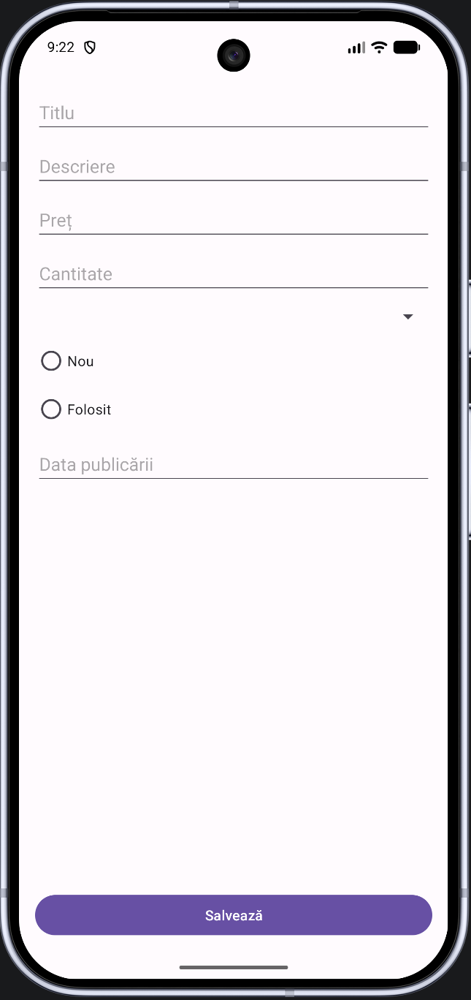

# 02 - Formular și model (POJO)

## Obiective

- să înțelegeți de ce separăm **modelul de date** de interfața grafică;
- să construiți un ecran de formular cu controale tipice (`EditText`, `Spinner`, `RadioGroup`);
- să folosiți noțiunile de **Context**, **Adapter** (pentru Spinner) și **resurse**;
- să citiți valorile din interfață cu View Binding și le afișați în Logcat și prin `Toast`.

Ghidul continuă aplicația începută în Seminarul 1. Dacă nu ați fost la curs, citiți explicațiile teoretice din fiecare secțiune înainte de activitatea practică.

## De unde porniți

- Starea de la finalul Seminarului 1 (tag `Seminar_1-grupa1086` sau `Seminar_1-grupa1088`, ori branch-ul grupei: `git pull` sau **Clone Repository** din Android Studio - vezi [README](../README.md)).
- View Binding activat; noțiunile de Activity, Logcat și Intent explicit din Seminarul 1.

## Domeniul aplicației (pe grupe)

Fiecare grupă lucrează pe **același tip de aplicație** pe tot semestrul, dar pe un **domeniu diferit**:

| Grupa    | Domeniu                                                          | Clasa model (tot semestrul) |
| -------- | ---------------------------------------------------------------- | --------------------------- |
| **1086** | Anunțuri second-hand între studenți (gen Vinted: cămin / campus) | `Anunt`                     |
| **1088** | Evidența abonamentelor (Spotify, YouTube, sală etc.)             | `Abonament`                 |

În exemplele de cod de mai jos apare adesea `Anunt`. Dacă sunteți în **1088**, folosiți `Abonament` și câmpurile din tabelul grupei voastre.

## 1. De ce avem nevoie de un model (POJO)

În Seminarul 1 ați afișat texte și ați navigat între ecrane. De acum, aplicația lucrează cu **date de domeniu**: un anunț are titlu, preț, categorie; un abonament are nume, cost, frecvență etc.

Dacă țineți aceste valori doar în câmpurile din XML, logica se împrăștie și nu puteți reutiliza datele în listă, bază de date sau rețea. De aceea introducem o clasă **model**:

- **POJO** (_Plain Old Java Object_) - o clasă Java obișnuită, cu câmpuri, constructori și metode de acces, fără a depinde de Android UI.
- Modelul descrie **ce** reprezintă datele; layout-ul și Activity-ul descriu **cum** le editează utilizatorul.

Această separare pregătește seminariile următoare, unde același obiect (`Anunt` sau `Abonament`) va circula între componente.

## 2. Controale de introducere a datelor

| Control                      | Rol                                                                                                                                                           |
| ---------------------------- | ------------------------------------------------------------------------------------------------------------------------------------------------------------- |
| `EditText`                   | Text liber (`String`: titlu/nume, descriere/observații) și valori numerice ca text (`double`, `int`); data se introduce ca text și se parsează la `LocalDate` |
| `Spinner`                    | Alegere dintr-o listă fixă (categorie anunț sau frecvență abonament)                                                                                          |
| `RadioGroup` + `RadioButton` | Alegere exclusivă între două etichete, păstrată în model ca `boolean` (`nou` sau `activ`)                                                                     |
| `Button`                     | Declanșează acțiunea (Salvează)                                                                                                                               |

Un **Spinner** nu „știe” singur ce texte să afișeze: are nevoie de un **Adapter**, care leagă o sursă de date (de exemplu un vector de `String`) de rândurile din listă. `ArrayAdapter` este varianta simplă oferită de platformă.

Documentație: [Input controls](https://developer.android.com/develop/ui/views/touch-and-input/input-controls)

## 3. Modelul de date

Ambele grupe folosesc **aceleași tipuri** de câmpuri (ca să exersați aceleași controale și aceleași conversii). Diferențele sunt doar de domeniu de aplicație.

| Tip                       | Grupa 1086 - `Anunt`                                   | Grupa 1088 - `Abonament`                   |
| ------------------------- | ------------------------------------------------------ | ------------------------------------------ |
| `String`                  | `titlu`                                                | `nume` (ex. Spotify, sală)                 |
| `String`                  | `descriere`                                            | `observatii`                               |
| `double`                  | `pret`                                                 | `cost`                                     |
| `int`                     | `cantitate` (bucăți disponibile)                       | `nrPersoane` (câți folosesc planul)        |
| enum Java + Spinner       | `categorie` (Electronice, Cărți, Îmbrăcăminte, Altele) | `frecventa` (Lunar, Anual, Săptămânal)     |
| `boolean` + RadioGroup    | `nou` (`true` = Nou, `false` = Folosit)                | `activ` (`true` = Activ, `false` = Anulat) |
| `LocalDate` (`java.time`) | `dataPublicare`                                        | `dataReinnoire`                            |

`categorie` și `frecventa` sunt enum Java, nu `String`. Constantele nu au diacritice; eticheta din Spinner este textul pe care îl vede utilizatorul. La salvare convertiți eticheta în constantă, cu o metodă statică pe **enum**: enum-ul își cunoaște propriile etichete. Clasa enum se pune în pachetul `domeniu`, împreună cu modelul (pasul 4). Exemplu pentru 1086 (1088 urmează același tipar, cu `Frecventa` și Lunar / Anual / Săptămânal):

```java
public enum Categorie {
    ELECTRONICE, CARTI, IMBRACAMINTE, ALTELE;

    public static Categorie dinEticheta(String eticheta) {
        return switch (eticheta) {
            case "Electronice" -> ELECTRONICE;
            case "Cărți" -> CARTI;
            case "Îmbrăcăminte" -> IMBRACAMINTE;
            default -> ALTELE;
        };
    }
}
```

Cazurile din `switch` trebuie să coincidă **exact** cu șirurile din Spinner (inclusiv diacriticele, dacă le folosiți). Pe 1088: `Frecventa.dinEticheta`, cu `"Lunar"`, `"Anual"` și default `Saptamanal`.

`nou` și `activ` sunt `boolean`. RadioGroup-ul arată ambele etichete; în model rămâne o singură valoare. `true` înseamnă Nou, respectiv Activ.

**Data:** folosiți `java.time.LocalDate`, nu `String` și nu `java.util.Date` (API vechi). În formular, data poate fi introdusă ca text în `EditText` (format ISO `yyyy-MM-dd`, de exemplu `2026-10-15`) și convertită cu:

```java
LocalDate data = LocalDate.parse(textDinEditText, DateTimeFormatter.ISO_LOCAL_DATE);
```

La afișare: `data.format(DateTimeFormatter.ISO_LOCAL_DATE)` (sau un formatter cu pattern propriu). Puteți face un `DatePicker` care produce `LocalDate`, ca temă opțională. 😉

Pe dispozitive cu API sub 26, `java.time` cere **core library desugaring** în Gradle (pasul din Seminarul 1, la configurarea SDK). Fără el, pe emulatorul vechi sau pe unele telefoane aplicația poate eșua la runtime.

Păstrați **aceeași** denumire de clasă pe tot semestrul (`Anunt` sau `Abonament`).

## 4. Clasa model

Modelul și enum-ul stau în pachetul `ro.ase.semdam.domeniu`. Activity-urile rămân în `ro.ase.semdam`.

### Activitate

1. Click dreapta pe pachetul `ro.ase.semdam` → **New → Package** → `domeniu`.
2. În `domeniu`: **New → Java Class** → enum `Categorie` (1086) sau `Frecventa` (1088), cu constantele din secțiunea 3. Fișierul începe cu `package ro.ase.semdam.domeniu;`.
3. Tot în `domeniu`: **New → Java Class** → `Anunt` (1086) sau `Abonament` (1088).
4. Adăugați **toate** câmpurile din tabelul de mai sus (private), constructor, getter/setter și `toString()`. Parametrii constructorului urmează ordinea din tabel. La 1086: `titlu`, `descriere`, `pret`, `cantitate`, `categorie`, `nou`, `dataPublicare`. La 1088: `nume`, `observatii`, `cost`, `nrPersoane`, `frecventa`, `activ`, `dataReinnoire`.
5. Deocamdată nu este necesar ca modelul să implementeze `Serializable`. Interfața va fi adăugată atunci când obiectul este transmis prin Intent, într-un seminar viitor.

Metoda `toString()` este importantă: când veți afișa o listă, fiecare element poate folosi exact acest text (de exemplu titlu + preț, sau nume + cost).

În `AddActivity` importați clasa din pachetul nou, de exemplu `import ro.ase.semdam.domeniu.Anunt;` (la 1088, `Abonament`).

## 5. Activity de adăugare

O a doua Activity dedicată formularului păstrează `MainActivity` mai clară (ecran principal versus ecran de editare). Este un tipar frecvent: **listă / detaliu** sau **listă / formular**.

Adăugarea este acțiunea principală a ecranului, așadar vom folosi un **FAB** (_Floating Action Button_) din `MainActivity`. Meniul din bara de acțiune, pentru navigare între ecrane, îl vom acoperi într-un seminar viitor.

### Activitate

#### 1. Crearea activității

**New → Activity → Empty Views Activity** → `AddActivity`, Language **Java**. Șablonul nu scrie View Binding în `onCreate`; îl adăugați la pasul 3, ca la `SecondActivity`.

#### 2. Layout-ul formularului

Rădăcina lui `activity_add.xml` este **ConstraintLayout**, ca în Seminarul 1. Fiecare control pus direct în rădăcină are nevoie de constrângeri `app:layout_constraint...`. Fără ele, editorul păstrează doar `tools:layout_editor_absoluteX` / `Y` (poziție de previzualizare), iar la rulare view-ul sare în `(0, 0)`.

Așezați câmpurile unul sub altul. Primul se leagă de marginea de sus a părintelui. Fiecare control următor se leagă cu `app:layout_constraintTop_toBottomOf` de id-ul celui de deasupra. Pe `EditText` și `Spinner`, lățimea `0dp` împreună cu start și end legate de părinte întinde câmpul pe lățimea ecranului.

Identificatori:

- 1086: `etTitlu`, `etDescriere`, `etPret`, `etCantitate`, `spCategorie`, `rgStare` cu `rbNou` și `rbFolosit`, `etDataPublicare`, `btnSalveaza`.
- 1088: `etNume`, `etObservatii`, `etCost`, `etNrPersoane`, `spFrecventa`, `rgStatus` cu `rbActiv` și `rbAnulat`, `etDataReinnoire`, `btnSalveaza`.

`android:hint` este proprietatea care specifică textul afișat în câmpul gol, pentru a indica utilizatorului ce date ar trebui introduse. Vom folosi `android:inputType="numberDecimal"` la preț/cost, `number` la cantitate/nrPersoane, `text`, iar la celelalte `EditText`, inclusiv la dată (`yyyy-MM-dd`).

Exemplu de cod pentru 1086:

```xml
<EditText
    android:id="@+id/etTitlu"
    android:layout_width="0dp"
    android:layout_height="wrap_content"
    android:layout_margin="16dp"
    android:hint="Titlu"
    android:inputType="text"
    app:layout_constraintEnd_toEndOf="parent"
    app:layout_constraintStart_toStartOf="parent"
    app:layout_constraintTop_toTopOf="parent" />

<EditText
    android:id="@+id/etDescriere"
    android:layout_width="0dp"
    android:layout_height="wrap_content"
    android:layout_marginStart="16dp"
    android:layout_marginTop="8dp"
    android:layout_marginEnd="16dp"
    android:hint="Descriere"
    android:inputType="text"
    app:layout_constraintEnd_toEndOf="parent"
    app:layout_constraintStart_toStartOf="parent"
    app:layout_constraintTop_toBottomOf="@id/etTitlu" />
```

Continuați plasarea controalelor până la cel pentru dată: `etPret`, `etCantitate`, `spCategorie`, `rgStare`, `etDataPublicare`. La 1088 schimbați id-urile și hint-urile (Nume, Observații, Cost, Nr. persoane, Data reînnoirii). **Nu** legați butonul Salvează de ultimul câmp: el stă jos pe ecran, ancorat de marginea de jos a părintelui.

```xml
<Button
    android:id="@+id/btnSalveaza"
    android:layout_width="0dp"
    android:layout_height="wrap_content"
    android:layout_margin="16dp"
    android:text="Salvează"
    app:layout_constraintBottom_toBottomOf="parent"
    app:layout_constraintEnd_toEndOf="parent"
    app:layout_constraintStart_toStartOf="parent" />
```

`app:layout_constraintBottom_toBottomOf="parent"` fixează butonul la baza Activity-ului. Start și end pe părinte, cu lățime `0dp`, îl întind pe lățimea ecranului (cu marginile de 16 dp). Fără constrângerea de jos, butonul ar rămâne în lanțul de sus, imediat sub dată.

`RadioButton`-urile stau **în interiorul** lui `RadioGroup`. Constrângerile se pun la nivelul grupului; butoanele sunt așezate în interiorul grupului, unul sub altul.

```xml
<RadioGroup
    android:id="@+id/rgStare"
    android:layout_width="wrap_content"
    android:layout_height="wrap_content"
    android:layout_marginStart="16dp"
    android:layout_marginTop="8dp"
    app:layout_constraintStart_toStartOf="parent"
    app:layout_constraintTop_toBottomOf="@id/spCategorie">

    <RadioButton
        android:id="@+id/rbNou"
        android:layout_width="wrap_content"
        android:layout_height="wrap_content"
        android:text="Nou" />

    <RadioButton
        android:id="@+id/rbFolosit"
        android:layout_width="wrap_content"
        android:layout_height="wrap_content"
        android:text="Folosit" />
</RadioGroup>
```

La 1088: `rgStatus`, `rbActiv` („Activ”), `rbAnulat` („Anulat”), iar `layout_constraintTop_toBottomOf` indică `spFrecventa`.

Rezultatul așteptat pentru 1086:



#### 3. View Binding în AddActivity

În `onCreate`, după `EdgeToEdge.enable(this)`, același tipar ca în `MainActivity`. Clasa generată din `activity_add.xml` se numește `ActivityAddBinding` și se importă din `ro.ase.semdam.databinding`.

```java
binding = ActivityAddBinding.inflate(getLayoutInflater());
setContentView(binding.getRoot());
ViewCompat.setOnApplyWindowInsetsListener(binding.main, (v, insets) -> {
    Insets systemBars = insets.getInsets(WindowInsetsCompat.Type.systemBars());
    v.setPadding(systemBars.left, systemBars.top, systemBars.right, systemBars.bottom);
    return insets;
});
```

Dacă `ActivityAddBinding` rămâne roșu în editor după un build reușit, **File → Sync Project with Gradle Files** sau redeschideți proiectul.

#### 4. Populați Spinner-ul

În `onCreate`, după listener-ul de insets. Exemplu 1086:

```java
String[] categorii = {"Electronice", "Cărți", "Îmbrăcăminte", "Altele"};
ArrayAdapter<String> adapter = new ArrayAdapter<>(
        this, android.R.layout.simple_spinner_item, categorii);
adapter.setDropDownViewResource(android.R.layout.simple_spinner_dropdown_item);
binding.spCategorie.setAdapter(adapter);
```

Pentru 1088, vectorul este `{"Lunar", "Anual", "Săptămânal"}` pe `binding.spFrecventa`.

#### 5. Butonul Salvează

`binding.etTitlu.getText()` întoarce textul din câmp. `toString().trim()` taie spațiile de la capete. Numerele din `EditText` sunt tot text: `Double.parseDouble` și `Integer.parseInt` le convertesc. Data trece prin `LocalDate.parse` cu `DateTimeFormatter.ISO_LOCAL_DATE`.

Spinner-ul dă eticheta afișată prin `getSelectedItem()`, nu constanta enum-ului. Apelați `Categorie.dinEticheta(...)` (sau `Frecventa.dinEticheta(...)`) pe care ați pus-o pe enum. La RadioGroup, `getCheckedRadioButtonId()` este id-ul butonului bifat. Comparați cu `binding.rbNou.getId()`. Dacă nu este bifat nimic, valoarea este `-1`. Asta nu înseamnă că `nou` este `false`, ci doar că nu a fost bifat nimic.

La acest seminar introduceți în formular valori valide (număr, dată `yyyy-MM-dd`, un buton radio bifat). Mesajele pentru câmp gol sau text care nu se poate converti le vom trata într-un seminar viitor.

În `AddActivity`, pentru 1086:

```java
binding.btnSalveaza.setOnClickListener(v -> {
    String titlu = binding.etTitlu.getText().toString().trim();
    String descriere = binding.etDescriere.getText().toString().trim();
    double pret = Double.parseDouble(binding.etPret.getText().toString().trim());
    int cantitate = Integer.parseInt(binding.etCantitate.getText().toString().trim());
    Categorie categorie = Categorie.dinEticheta(
            binding.spCategorie.getSelectedItem().toString());
    int idBifat = binding.rgStare.getCheckedRadioButtonId();
    boolean nou = idBifat == binding.rbNou.getId();
    LocalDate dataPublicare = LocalDate.parse(
            binding.etDataPublicare.getText().toString().trim(),
            DateTimeFormatter.ISO_LOCAL_DATE);

    Anunt obiect = new Anunt(titlu, descriere, pret, cantitate, categorie, nou, dataPublicare);
    Log.d("AddActivity", obiect.toString());
    Toast.makeText(this, "Salvat: " + obiect.toString(), Toast.LENGTH_SHORT).show();
});
```

Importuri: `ro.ase.semdam.domeniu.Anunt`, `ro.ase.semdam.domeniu.Categorie`, `java.time.LocalDate`, `java.time.format.DateTimeFormatter`, `android.util.Log`, `android.widget.Toast`. Listener-ul stă în `onCreate`, după ce Spinner-ul are adapter.

La 1088, aceeași structură, cu `Abonament`, `etNume`, `etObservatii`, `etCost`, `etNrPersoane`, `spFrecventa`, `rgStatus`, `rbActiv`, `etDataReinnoire` și `Frecventa.dinEticheta(...)` în loc de `Categorie.dinEticheta(...)`.

`boolean activ = binding.rgStatus.getCheckedRadioButtonId() == binding.rbActiv.getId();`

#### 6. FAB în MainActivity

Componenta este în biblioteca Material, deja prezentă în șablonul Empty Views Activity. În `activity_main.xml`, ancorați butonul de colțul din dreapta-jos. Păstrați controalele din Seminarul 1.

```xml
<com.google.android.material.floatingactionbutton.FloatingActionButton
    android:id="@+id/fabAdauga"
    android:layout_width="wrap_content"
    android:layout_height="wrap_content"
    android:layout_margin="16dp"
    android:contentDescription="Adaugă"
    android:src="@android:drawable/ic_input_add"
    app:layout_constraintBottom_toBottomOf="parent"
    app:layout_constraintEnd_toEndOf="parent" />
```

În `onCreate` din `MainActivity`, același Intent explicit ca la `SecondActivity`:

```java
binding.fabAdauga.setOnClickListener(v -> {
    Intent intent = new Intent(MainActivity.this, AddActivity.class);
    startActivity(intent);
});
```

Întoarcerea obiectului către `MainActivity` o vom acoperi într-un seminar viitor. Acum butonul Salvează doar scrie în Logcat și arată Toast-ul ca să vedem că am construit obiectul corect.

## 6. Context, resurse, Bundle

### Context

Clasa **Context** este o clasă abstractă din Android care oferă acces la resursele aplicației, la servicii ale sistemului și la operații precum pornirea unei Activity. Orice `Activity` este un `Context`. De aceea puteți scrie `Toast.makeText(this, ...)` sau `new ArrayAdapter<>(this, ...)`.

Nu confundați Context-ul cu „tot ecranul”: un Context de tip Application trăiește cât aplicația; unul de tip Activity trăiește cât ecranul. Pentru Toast și Adapter legate de UI, Context-ul Activity este cel potrivit, deoarece acestea corespund activității.

### Resurse și clasa R

Fișierele din `res/` (layout, string, menu) sunt compilate într-un index numeric. Clasa generată `R` (de exemplu `R.id.etTitlu`, `R.layout.activity_add`) oferă aceste identificatoare în Java. Dacă redenumiți un id în XML, trebuie să folosiți noul nume și în cod.

### Bundle

Un **Bundle** este un dicționar cheie-valoare folosit pentru a transporta date simple (sau obiecte serializabile) între componente, de obicei atașat unui Intent prin `putExtra` / `getExtra`. Într-un seminar viitor veți plasa modelul (sau câmpurile sale) în Intent, pe baza acestui mecanism.

Documentație: [Context](https://developer.android.com/reference/android/content/Context)

## Verificare

- [ ] Formularul se deschide din FAB-ul de pe ecranul principal.
- [ ] Controalele din `activity_add.xml` au constrângeri ConstraintLayout.
- [ ] Spinner-ul conține variantele definite prin Adapter.
- [ ] La Salvează apar mesaje coerente în Logcat și pe ecran (Toast).
- [ ] Modelul (`Anunt` sau `Abonament`) și enum-ul sunt în pachetul `domeniu`, nu lângă Activity-uri.
- [ ] Puteți explica pe scurt ce este un POJO și ce este Context.

## Bibliografie

- [Input controls](https://developer.android.com/develop/ui/views/touch-and-input/input-controls)
- [FloatingActionButton](https://developer.android.com/reference/com/google/android/material/floatingactionbutton/FloatingActionButton)
- [Context](https://developer.android.com/reference/android/content/Context)
- [Log](https://developer.android.com/reference/android/util/Log)

## Indexul ghidurilor

| Fișier                                                                     | Temă                                    |
| -------------------------------------------------------------------------- | --------------------------------------- |
| [01-proiect-activity-view-binding.md](01-proiect-activity-view-binding.md) | Proiect, Activity, View Binding, Intent |
| [02-formular-si-model.md](02-formular-si-model.md)                         | Formular, controale, model (POJO)       |
| [03-validare-activity-result.md](03-validare-activity-result.md)           | Validare, Activity Result API           |
| [04-lista-crud-memorie.md](04-lista-crud-memorie.md)                       | ListView, CRUD în memorie               |
| [05-adapter-meniu-fragmente.md](05-adapter-meniu-fragmente.md)             | Adapter personalizat, meniu, fragmente  |
| [06-retea-xml-bnr.md](06-retea-xml-bnr.md)                                 | Rețea asincronă, XML BNR                |
| [07-json-sharedpreferences.md](07-json-sharedpreferences.md)               | JSON, SharedPreferences                 |
| [08-room.md](08-room.md)                                                   | Room (SQLite)                           |
| [09-firebase.md](09-firebase.md)                                           | Firebase Realtime Database              |
| [10-grafica-canvas.md](10-grafica-canvas.md)                               | Grafică 2D pe Canvas                    |
| [11-recapitulare-publicare.md](11-recapitulare-publicare.md)               | Recapitulare, hărți (demo), publicare   |
